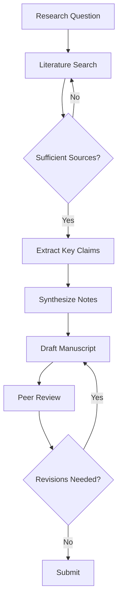

# Figures and Diagrams

Two tools for generating publication-quality figures from text-based source files: Mermaid for diagrams and gnuplot for data visualizations.

## Mermaid CLI — Text-Based Diagrams

**Install:** `npm install -g @mermaid-js/mermaid-cli`

Mermaid renders flowcharts, sequence diagrams, mind maps, Gantt charts, and more from plain-text `.mmd` files. Diagrams live in `figures/` and compile to PNG or SVG.

### Usage

Build a single diagram:

```bash
make figure SRC="figures/diagram.mmd"
```

Build all `.mmd` files in `figures/`:

```bash
make figures
```

### Example: Flowchart

Create `figures/research-workflow.mmd`:



This produces a top-down flowchart with decision nodes at "Sufficient Sources?" and "Revisions Needed?".

### Supported Diagram Types

| Type | Directive | Use case |
|---|---|---|
| Flowchart | `flowchart TD` / `flowchart LR` | Process flows, decision trees |
| Sequence diagram | `sequenceDiagram` | Interactions between systems/actors |
| Mind map | `mindmap` | Brainstorming, concept mapping |
| Gantt chart | `gantt` | Project timelines |
| Class diagram | `classDiagram` | System architecture |
| State diagram | `stateDiagram-v2` | State machines, workflows |

### Configuration

Mermaid CLI accepts a config JSON file for theming. Create `figures/mermaid-config.json` if you need custom fonts or colors:

```json
{
  "theme": "neutral",
  "themeVariables": {
    "fontFamily": "serif"
  }
}
```

Then pass it: `mmdc -i diagram.mmd -o diagram.png -c mermaid-config.json`

---

## gnuplot — Data Visualization

**Install:** `brew install gnuplot`

gnuplot renders scatter plots, line charts, bar charts, and histograms from data files. Write `.gp` scripts in `figures/`, which reference data files in the same directory.

### Usage

Run a single plot script:

```bash
make plot SRC="figures/chart.gp"
```

### Example: Scatter Plot

Create `figures/accuracy.gp`:

```gnuplot
set terminal pngcairo size 800,600 font "Helvetica,12"
set output "figures/accuracy.png"

set title "Model Accuracy vs. Training Set Size"
set xlabel "Training samples"
set ylabel "Accuracy (%)"
set grid
set key top left

plot "figures/accuracy.dat" using 1:2 with linespoints \
     title "GPT-4" lw 2 pt 7, \
     "" using 1:3 with linespoints \
     title "Claude" lw 2 pt 5
```

With a data file `figures/accuracy.dat`:

```
# samples  gpt4  claude
100        62.3  64.1
500        71.8  73.2
1000       78.5  80.1
5000       85.2  87.4
10000      89.1  90.8
```

Run with `gnuplot figures/accuracy.gp` or `make plot SRC="figures/accuracy.gp"`.

### Common Terminal Types

| Terminal | Output | Best for |
|---|---|---|
| `pngcairo` | PNG | Manuscript drafts, quick preview |
| `pdfcairo` | PDF | Final publication figures |
| `svg` | SVG | Web, scalable graphics |
| `epslatex` | EPS + LaTeX | LaTeX documents with matching fonts |

---

## Integrating Figures with pandoc-crossref

Reference figures in your manuscript using pandoc-crossref syntax:

### Including a Figure

```markdown
{#fig:accuracy}
```

- The text in `[]` is the caption.
- The path in `()` points to the generated image.
- `{#fig:accuracy}` assigns a cross-reference label.

### Referencing a Figure

```markdown
As shown in @fig:accuracy, accuracy plateaus above 5,000 samples.
```

This renders as "As shown in Figure 1, accuracy plateaus above 5,000 samples." (with automatic numbering).

### Multiple Figures

```markdown
See @fig:accuracy and @fig:latency for the full results.
```

pandoc-crossref resolves all `@fig:` references to the correct figure numbers at build time. The same pattern works for tables (`@tbl:`), equations (`@eq:`), and sections (`@sec:`).
